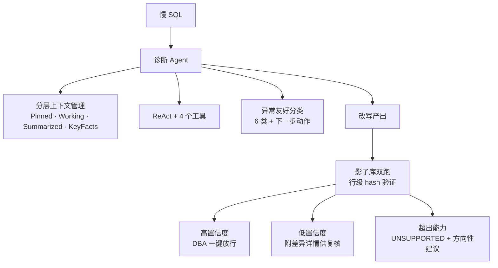

# Slow SQL Agent

> 基于 LLM Agent 的 MySQL 深分页慢 SQL 智能诊断系统

[]()
[]()
[]()
[]()

## 介绍

针对生产环境高频的 MySQL 深分页慢查询,Agent 自动诊断瓶颈、产出延迟关联 / 游标分页 / 索引建议等改写方案,改写产出经影子库双跑验证语义等价后**高置信度结果由 DBA 一键放行,不等价结果附差异详情供重点复核**,将常规深分页 case 的等待 + 处理总时长从小时/天级压缩至分钟级。

配合分层上下文管理与工具异常 LLM 友好分类,在长链路 ReAct 中显著降低 token 消耗与工具重复调用。

## 核心能力

### 🧠 分层上下文工程

设计**「不可压缩指令 / 当前轮 / 历史摘要 / 结构化事实」四层上下文**,schema 与索引以结构化事实持久存储,LLM 后续轮次无需重复查询。**token 占用较默认滑窗降低约 30%**。

### ✅ 改写语义等价性自动验证

影子库对原 SQL 与改写 SQL 进行**双跑 + 行级 hash 比对**,处理排序、NULL、重复行等边界。等价结果标"高置信度"供 DBA 一键放行,不等价附差异详情供重点复核,大幅降低复核成本。

### 🔧 工具异常 LLM 友好分类

将工具调用异常**收敛为 6 类**(`SYNTAX_ERROR` / `NOT_FOUND` / `PERMISSION_DENIED` / `SAFETY_REJECTED` / `TIMEOUT` / `INTERNAL_ERROR`),每类附明确的下一步动作提示(如"表或列不存在,先调用 `getTableInfo` 探查表结构"),LLM 重复调用与死循环率显著下降。

### 📊 数据驱动改写决策

tie-breaker 追加、索引建议基于 `getColumnStats` 返回的客观列统计(cardinality / 选择性 / NULL 比例),DBA 在产出中可直接审计 "based on cardinality=X, selectivity=Y" 的判定依据,而非 LLM 经验拍脑袋。

## 架构



## 工具集

| 工具 | 作用 |
|---|---|
| `runExplain` | 估算 SQL 执行计划(type / key / rows / Extra) |
| `getTableInfo` | 获取表结构信息(PK / 索引定义 / 列类型) |
| `getColumnStats` | 获取列分布(cardinality / 选择性 / NULL 比例) |
| `verifyResultEquivalence` | 影子库双跑 + 行级 hash 验证改写等价性 |

每个工具返回结构化 `ToolResult`(不抛异常,异常由统一分类层收敛为 6 类),走影子库,输入严格校验防 SQL 注入,调用结束后由 listener 自动抽取关键事实写入结构化事实库。

## 评测

20 条标注 case(见 [`samples/golden_set.json`](./samples/golden_set.json))覆盖深分页主要场景:单表 / JOIN / 多表 / tie-breaker / 业务约束 / 反例。

**三层指标驱动迭代**:
- **业务价值** — P95 耗时、高置信度产出率、token 占用降幅
- **改写效果** — outcome 命中率、verify 通过率、cost 下降中位数
- **Agent 行为** — 平均 ReAct 轮次、工具重复调用率、异常分布

```bash
mvn test -Peval-full              # 全量 20 条 × 3 次取均值
mvn test -Peval -Dcases=smoke     # 核心 5 条 smoke,< 1 分钟
```

输出 HTML 报告至 `target/eval-reports/`,支持多版本 A/B 对比。

## 技术栈

- **Java 17** / **Spring Boot 3.x**
- **LangChain4j** AiServices + `@Tool` + ChatModelListener,接入小米 MiMo
- **Alibaba Druid** SQL 解析与 AST 改写
- **MyBatis-Plus** ORM
- **Redis Stream** 消息队列 / **Caffeine** 本地缓存
- **MySQL 8.0** + **Docker Compose**
- **JUnit 5** + **AssertJ** + **Testcontainers**

## License

MIT
