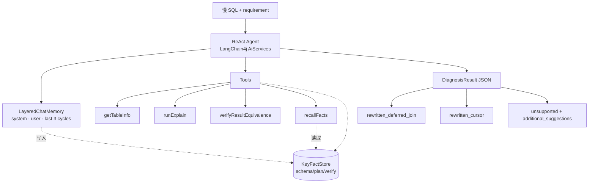

# Slow SQL Agent

> 基于 LLM Agent 的 MySQL 深分页慢 SQL 诊断系统

[]()
[]()
[]()
[]()

## 介绍

针对生产环境高频的 MySQL 深分页慢查询,Agent 在 ReAct 主循环里调用工具收集 schema / EXPLAIN 计划 / 改写校验等事实,产出**三种可执行结果**:

- `rewritten_deferred_join` — 改写为延迟关联(子查询取 PK + 外层 JOIN 反查)
- `rewritten_cursor` — 改写为游标分页(`WHERE pk > last_id`),需业务允许改 API
- `unsupported` — 超出 SQL 改写范围(缺索引 / 聚合 / DISTINCT / 副表排序 / 非 SELECT),把可执行建议(`CREATE INDEX` DDL / 物化视图等)写到 `additional_suggestions`

输入约定为已从慢查询日志过滤出的语句,不会出现"其实不慢"的输入。

## 核心能力

### 🧠 LLM 驱动的分层上下文

`LayeredChatMemory` 实现 LangChain4j `ChatMemory`:
- **system / user message** 静态保留
- **最近 K 个 ReAct 周期**(默认 3) FIFO 截断,按 cycle 而非 message,避免孤立 tool request/response 让模型崩
- 每次 `ToolExecutionResultMessage` 进入 memory 时,**`FactExtractor` 旁路自动抽取结构化事实**(schema / plan / verify 三类)累积到 `KeyFactStore`
- **`recallFacts` 工具**让 LLM 主动召回累积事实摘要 —— pull 而非 push,LLM 自己决定什么时候要,不强占每轮 prompt

效果:prompt token 不随轮次线性增长,被截断的旧 cycle 信息仍能通过 `recallFacts` 召回。

### ✅ 改写正确性按形态分流校验

`verifyResultEquivalence` 工具按改写形态**自动选两种策略**:

| 改写形态 | 检测方式 | 策略 |
|---|---|---|
| 改写仍含 `OFFSET`(deferred_join) | 检测 `LIMIT m,n` / `OFFSET m` | **行级 hash**:双跑前 100 行,按 JDBC 列类型规范化(TIMESTAMP→epoch / DECIMAL→stripZeros / CHAR→trim 等)后 SHA-256 比对 |
| 改写消除了 `OFFSET`(cursor) | 原 SQL 含 OFFSET 但改写不含 | **计划校验**:EXPLAIN 改写 SQL,验证 `type != ALL` / `key != NULL` / 含 `ORDER BY`;同时 EXPLAIN 原 SQL 算 `rows_reduction_pct` |

两条路径都返回 PASS 时一并附 plan 摘要,供下游评测层算真实 cost 降幅。

### 🔧 失败友好提示

工具返回结构化 record(`TableInfoResult` / `ExplainResult` / `VerifyResult`),序列化为 JSON 发给 LLM。每个错误/失败的 `reason` 自动经 `HintCatalog` 查表附上**可操作 hint**(如 `missing_order_by` → "cursor 改写必须包含 ORDER BY 子句保证游标可重复. 加上 ORDER BY <游标列>."),减少 LLM 自纠正死循环。

### 📊 真实指标驱动评测

三层指标全部来自工具实际返回,不用 confidence 等代理值:

- **业务价值**:p95 延迟、高置信度产出率
- **改写效果**:outcome 命中率、verify pass 率(基于 `stats.verifyPassCount > 0`)、`cost_reduction_median`(基于 EXPLAIN rows 真实下降)、business_context 合规率(检查 cursor 改写是否违反 requirement 里的"不可改 API"约束)、assumptions 显式率
- **Agent 行为**:平均 ReAct 轮次、工具重复调用率(SHA-1 fingerprint 去碰撞)

## 架构



## 工具集

| 工具 | 作用 | 返回 |
|---|---|---|
| `getTableInfo(tableName)` | CREATE TABLE + 索引摘要(name/columns/cardinality)+ 行数估算 | `TableInfoResult` JSON |
| `runExplain(sql)` | EXPLAIN 结果行列表 | `ExplainResult` JSON |
| `verifyResultEquivalence(originalSql, rewrittenSql)` | 按改写形态自动分流的等价 / 计划校验 | `VerifyResult` JSON,含 `rows_reduction_pct` 等 |
| `recallFacts(category?)` | 召回本次诊断累积的 schema/plan/verify 事实摘要 | `{status, total_count, facts:[{category,subject,detail}]}` |

工具入口经 `SqlSafety` 字符串层过滤拒非 SELECT/WITH 与多语句,JDBC 层 `DataSource` 设 `readOnly=true` 物理拒写。

## 评测

17 条标注 case(见 [`samples/golden_set.json`](./samples/golden_set.json)),覆盖三种 outcome:

| outcome | 数量 | 典型场景 |
|---|---|---|
| `rewritten_deferred_join` | 5 | 不可改 API 的传统翻页:单表 / WHERE 过滤 / SELECT * 带 TEXT / 多表 JOIN |
| `rewritten_cursor` | 4 | 可改 API 的下拉/无限滚动:PK 升降序 / 非 PK 排序复合游标 / 1:N JOIN |
| `unsupported` | 8 | 缺索引 → DDL 建议 / GROUP BY / DISTINCT / 副表排序 / DML 拒绝 / 嵌套子查询 |

**三层指标**:

```
业务价值:    p95_latency_ms, high_confidence_rate
改写效果:    outcome_match_rate, verification_pass_rate, cost_reduction_median,
            business_context_compliance, assumptions_explicit_rate
Agent 行为:  avg_react_rounds, repeated_tool_call_rate
```

输出 HTML 报告位于 `target/eval-reports/`。

## 快速开始

### 起 MySQL 与灌数据

```bash
docker compose up -d mysql

# 默认 5000 行 schema 灌数据(秒级),百万级演示用 @scale=1000000
( echo 'SET @scale := 1000000;'; cat samples/seed.sql ) | \
  docker exec -i slowsql-mysql mysql -uroot -proot slow_sql_agent
```

### 跑评测

```bash
# Smoke: 5 个代表 case × 1 iter, MockToolBackend 走通主回路
mvn -Dtest=EvalRunnerSmokeTest test

# 全量 17 case × 3 iter(真 LLM + 真 MySQL)
SLOW_SQL_LLM_BASE_URL=... SLOW_SQL_LLM_API_KEY=... SLOW_SQL_LLM_MODEL=... \
SLOW_SQL_LLM_EXTRA_BODY='{"thinking":{"type":"disabled"}}' \
SLOW_SQL_DB_URL='jdbc:mysql://localhost:3307/slow_sql_agent?useSSL=false&allowPublicKeyRetrieval=true' \
SLOW_SQL_DB_USER=root SLOW_SQL_DB_PASSWORD=root \
mvn -Dtest=LangChain4jEvalRunnerIT#fullEval test
```

LLM 端点支持任何 OpenAI 兼容服务(MiMo / DeepSeek / Qwen 等),`SLOW_SQL_LLM_EXTRA_BODY` 用于传递 vendor 特有参数(如 MiMo 关思考模式)。

## 技术栈

- **Java 17** + Maven
- **LangChain4j 1.12** AiServices + `@Tool` + 自定义 `ChatMemory`
- **HikariCP** + MySQL Connector/J(JDBC 直连,无 ORM)
- **Jackson** 工具结果序列化(record + NON_NULL)
- **JUnit 5** + AssertJ
- **Docker Compose** 起本地 MySQL 8

## License

MIT
