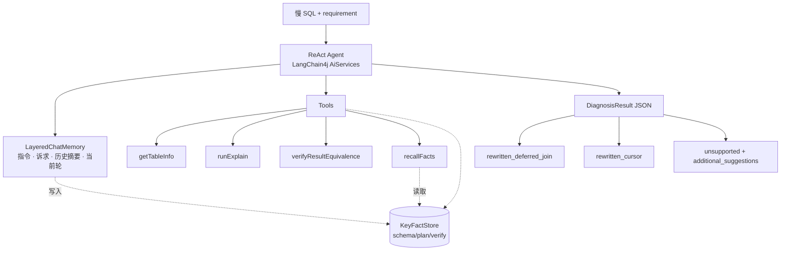

# Slow SQL Agent

> 基于 LLM Agent 的 MySQL 深分页慢 SQL 诊断系统

[]()
[]()
[]()
[]()

## 介绍

针对生产环境高频的 MySQL 深分页慢查询,Agent 在 ReAct 主循环里调用工具收集 schema / EXPLAIN 计划 / 改写校验等事实,产出**三种可执行结果**:

- `rewritten_deferred_join` — 改写为延迟关联(子查询取 PK + 外层 JOIN 反查)
- `rewritten_cursor` — 改写为游标分页(`WHERE pk > last_id`),需业务允许改 API
- `unsupported` — 超出 SQL 改写范围(缺索引 / 聚合 / DISTINCT / 副表排序 / 非 SELECT),把可执行建议(`CREATE INDEX` DDL / 物化视图等)写到 `additional_suggestions`

输入约定为已从慢查询日志过滤出的语句,不会出现"其实不慢"的输入。

## 核心能力

### 🧠 LLM 驱动的分层上下文

`LayeredChatMemory` 实现 LangChain4j `ChatMemory`,四层上下文:

| 层 | 内容 | 处理策略 |
|---|---|---|
| 不可压缩指令 | `SystemMessage`(决策树 / 工具纪律) | 永久保留 |
| 不可压缩诉求 | `UserMessage`(原始 SQL + 业务说明) | 永久保留 |
| 历史摘要 | 超出窗口的旧 ReAct 周期 | `LlmHistorySummarizer` 语义压缩 + 增量累积 |
| 当前轮 | 最近 K 个完整 ReAct 周期(默认 3) | 原样保留 |

按 **cycle 粒度**而非 message 截断,避免孤立 tool request / response 让模型崩。超出窗口的最老 cycle 不直接丢:交给 `HistorySummarizer` 与既有摘要合并,新摘要作为 `SystemMessage` 注入到下一轮 prompt。

旁路 `KeyFactStore`:每次 `ToolExecutionResultMessage` 进入 memory 时,`FactExtractor` 自动抽取结构化事实(schema / plan / verify 三类)累积到 store。LLM 通过 `recallFacts` 工具按需 pull —— 不强占每轮 prompt。

效果:prompt token 不随轮次线性增长;早期工具结果通过"语义摘要 + 结构化事实"两条通道召回,行为脉络与离散事实互补。

### ✅ 改写正确性按形态分流校验

`verifyResultEquivalence` 工具按改写形态**自动选两种策略**:

| 改写形态 | 检测方式 | 策略 |
|---|---|---|
| 改写仍含 `OFFSET`(deferred_join) | 检测 `LIMIT m,n` / `OFFSET m` | **行级 hash**:双跑前 100 行,按 JDBC 列类型规范化(TIMESTAMP→epoch / DECIMAL→stripZeros / CHAR→trim 等)后 SHA-256 比对 |
| 改写消除了 `OFFSET`(cursor) | 原 SQL 含 OFFSET 但改写不含 | **计划校验**:EXPLAIN 改写 SQL,验证 `type != ALL` / `key != NULL` / 含 `ORDER BY`;同时 EXPLAIN 原 SQL 算 `rows_reduction_pct` |

两条路径都返回 PASS 时一并附 plan 摘要,供下游评测层算真实 cost 降幅。

### 🔧 失败友好提示 — 6 类异常 + 下一步动作

工具返回结构化 record(`TableInfoResult` / `ExplainResult` / `VerifyResult`),失败时附 `category` + `hint` 两个字段(`ErrorCategory` 枚举):

| 类别 | 高频场景 | hint 方向 |
|---|---|---|
| `SCHEMA_NOT_FOUND` | LLM 把表名/列名写错或猜错 | "对象不存在或名字非法, 检查原 SQL 引用了哪张表/列, 不要乱猜" |
| `SYNTAX_ERROR` | cursor 改写占位符 `?` 没填值 / 引号不匹配 | "占位符改成 `0` 之类示例值, 在 assumptions 里说明占位语义" |
| `SAFETY_REJECTED` | LLM 在 rewrittenSql 里写了 DML / 多语句 / 把参数调换 | "rewritten 必须 SELECT, 检查参数顺序, 不要传 UPDATE/DELETE" |
| `SEMANTIC_DIVERGENCE` | 改写后行集与原 SQL 不等价 | "对照原 SQL 逐项检查 WHERE/JOIN/SELECT/DISTINCT" |
| `UNSTABLE_ORDER` | deferred_join 漏 tie-breaker / cursor 改写漏 ORDER BY | "deferred_join: ORDER BY 末尾加 PK; cursor: 必须有 ORDER BY" |
| `PLAN_UNHEALTHY` | cursor 改写 EXPLAIN 显示全表扫或未走索引 | "让 WHERE 命中索引 / 用 PK 做游标谓词 / 不在游标列加函数" |

设计:
- 类别覆盖深分页诊断里 LLM **极大概率会撞上**的错误形态;罕见细分原因归到对应大类共用 hint
- 类别即"LLM-actionable 错误",系统级问题(JDBC 内部错 / 序列化失败)走 `INTERNAL` 兜底类
- hint 措辞约束:短/指方向/含可操作动词,不替 LLM 推理只点出"该改什么"

### 📊 真实指标驱动评测

三层指标全部来自工具实际返回,不用 confidence 等代理值:

- **业务价值**:p95 延迟、高置信度产出率
- **改写效果**:outcome 命中率、verify pass 率(基于 `stats.verifyPassCount > 0`)、`cost_reduction_median`(基于 EXPLAIN rows 真实下降)、business_context 合规率(检查 cursor 改写是否违反 requirement 里的"不可改 API"约束)、assumptions 显式率
- **Agent 行为**:平均 ReAct 轮次、工具重复调用率(SHA-1 fingerprint 去碰撞)

## 架构



## 工具集

| 工具 | 作用 | 返回 |
|---|---|---|
| `getTableInfo(tableName)` | CREATE TABLE + 索引摘要(name/columns/cardinality)+ 行数估算 | `TableInfoResult` JSON |
| `runExplain(sql)` | EXPLAIN 结果行列表 | `ExplainResult` JSON |
| `verifyResultEquivalence(originalSql, rewrittenSql)` | 按改写形态自动分流的等价 / 计划校验 | `VerifyResult` JSON,含 `rows_reduction_pct` 等 |
| `recallFacts(category?)` | 召回本次诊断累积的 schema/plan/verify 事实摘要 | `{status, total_count, facts:[{category,subject,detail}]}` |

工具入口经 `SqlSafety` 字符串层过滤拒非 SELECT/WITH 与多语句,JDBC 层 `DataSource` 设 `readOnly=true` 物理拒写。

## 评测

22 条标注 case(见 [`samples/golden_set.json`](./samples/golden_set.json)),覆盖三种 outcome:

| outcome | 数量 | 典型场景 |
|---|---|---|
| `rewritten_deferred_join` | 8 | 不可改 API 的传统翻页:单表 / WHERE 过滤 / SELECT * 带 TEXT / 多表 JOIN / 5 表 JOIN + 非唯一排序键(高轮次) / 软删 / 可空 tie-breaker |
| `rewritten_cursor` | 5 | 可改 API 的下拉/无限滚动:PK 升降序 / 非 PK 排序复合游标 / JOIN / 可空列复合游标 |
| `unsupported` | 9 | 缺索引 → DDL 建议 / GROUP BY / DISTINCT / 副表排序 / DML 拒绝 / 嵌套子查询 / 函数列排序 |

**三层指标**:

```
业务价值:    p95_latency_ms, high_confidence_rate
改写效果:    outcome_match_rate, verification_pass_rate, cost_reduction_median,
            business_context_compliance, assumptions_explicit_rate
Agent 行为:  avg_react_rounds, repeated_tool_call_rate
```

输出 HTML 报告位于 `target/eval-reports/`。

## 快速开始

### 环境变量

跑真 LLM + 真 MySQL 评测前需要注入下列变量(smoke 不接 LLM/DB,可跳过):

```
# LLM (OpenAI 兼容端点, 任选 MiMo / DeepSeek / Qwen 等)
SLOW_SQL_LLM_BASE_URL=...        例: https://api.deepseek.com/v1 (兼容 OpenAI)
SLOW_SQL_LLM_API_KEY=...
SLOW_SQL_LLM_MODEL=...           例: deepseek-chat / mimo-v2.5-pro
SLOW_SQL_LLM_EXTRA_BODY=...      可选: {"thinking":{"type":"disabled"}}   # 给 vendor 特有参数 (如 MiMo 关思考模式)

# MySQL (docker compose 起的本地实例默认值见下方)
SLOW_SQL_DB_URL=jdbc:mysql://localhost:3307/slow_sql_agent?useSSL=false&allowPublicKeyRetrieval=true
SLOW_SQL_DB_USER=root
SLOW_SQL_DB_PASSWORD=root
```

### 起 MySQL 与灌数据

```bash
docker compose up -d mysql

# 默认 5000 行 schema 灌数据(秒级),百万级演示用 @scale=1000000
( echo 'SET @scale := 1000000;'; cat samples/seed.sql ) | \
  docker exec -i slowsql-mysql mysql -uroot -proot slow_sql_agent
```

### 跑评测

```bash
# Smoke: 5 个代表 case × 1 iter, StubDiagnosisAgent 走通 eval 主回路
# 仅 plumbing 检查 (不接 LLM 与 MySQL), 有信号的指标是 outcome_match_rate,
# verify / token / round 在 Stub 下结构性为 0, 不应作为质量信号读
mvn -Dtest=EvalRunnerSmokeTest test

# 全量 22 case × 3 iter(真 LLM + 真 MySQL)
mvn -Dtest=LangChain4jEvalRunnerIT#fullEval test

# Token 降幅对照实验: 同 case 集分别跑 LayeredChatMemory 与 MessageWindowChatMemory(10),
# 落 target/eval-reports/memory-comparison-*.json + 控制台对照表
mvn -Dtest=MemoryComparisonIT#compare test
```

## REST 服务

`mvn package` 出可执行 jar, `java -jar target/slow-sql-agent-*.jar` 起服务 (默认 8080 端口).
唯一端点:

```bash
curl -X POST http://localhost:8080/api/diagnose \
  -H "Content-Type: application/json" \
  -d '{
    "sql": "SELECT id, user_id, amount FROM orders ORDER BY id LIMIT 500000, 20",
    "requirement": "运营后台订单翻页, 传统翻页 URL 不可改"
  }'
```

返回结构 (含 stats 块, 便于调用方观察 token 消耗与轮次):

```json
{
  "result": {
    "outcome": "REWRITTEN_DEFERRED_JOIN",
    "rewrittenSql": "SELECT o.id, o.user_id, o.amount FROM orders o JOIN (SELECT id FROM orders ORDER BY id LIMIT 500000, 20) t ON o.id = t.id",
    "assumptions": ["...", "..."],
    "confidence": 0.95,
    "additionalSuggestions": []
  },
  "stats": {
    "react_rounds": 4,
    "total_tool_calls": 3,
    "summarizer_invocations": 0,
    "total_tokens": 17805,
    "elapsed_ms": 29150
  }
}
```

agent 实例每请求独立创建, AgentStatsListener 不跨请求污染; LlmConfig / HikariCP DataSource / ToolBackend 作 Spring bean 复用. 同步阻塞调用, 单请求 30s-2min, 生产部署需要前置 LB 留足 timeout.

## 技术栈

- **Java 17** + Maven + **Spring Boot 3.4** (REST 服务化外壳)
- **LangChain4j 1.12** AiServices + `@Tool` + 自定义 `ChatMemory`
- **HikariCP** + MySQL Connector/J(JDBC 直连,无 ORM)
- **Jackson** 工具结果序列化(record + NON_NULL)
- **JUnit 5** + AssertJ
- **Docker Compose** 起本地 MySQL 8

## License

MIT
